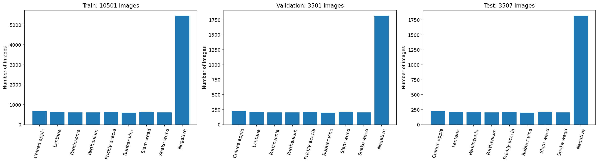
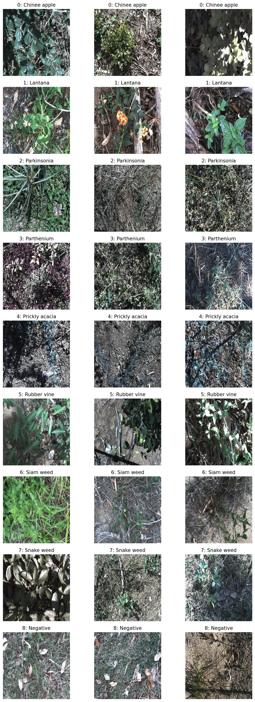
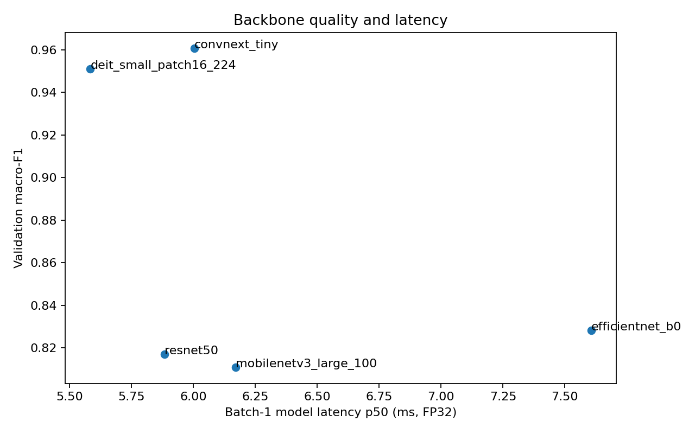
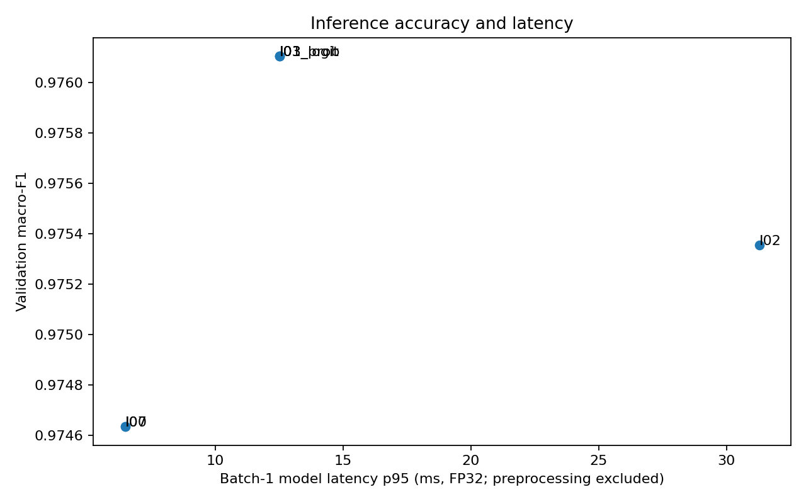
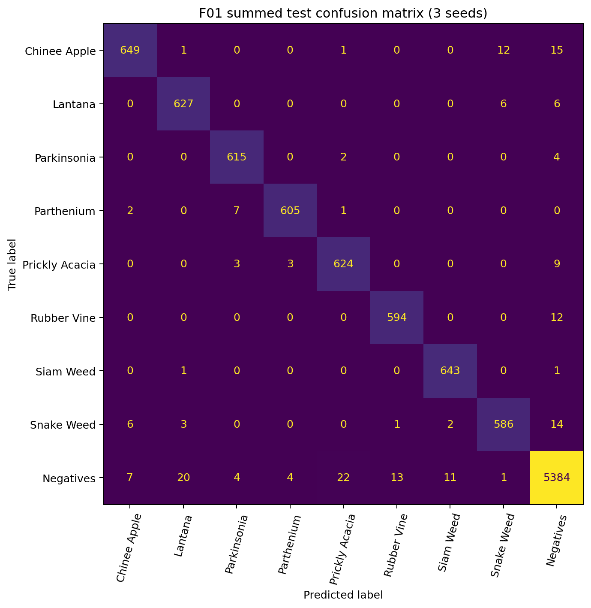
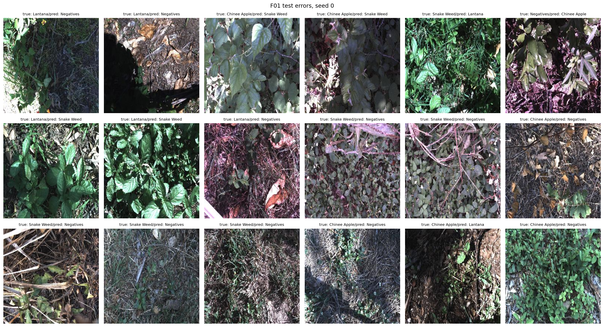

# Báo cáo Lab Day 2 — DeepWeeds

## 1. Tóm tắt

- Bài toán: phân loại ảnh DeepWeeds thành 9 lớp, dùng fold 0 có sẵn.
- Kết quả cuối: ConvNeXt-Tiny pretrained, fine-tune với công thức T08 (CutMix + EMA), 20 epoch; inference I03_logit (trung bình logits của ảnh gốc và ảnh lật ngang), temperature fit riêng trên validation của từng seed.
- Final và baseline đều chạy seed 0, 1, 2. Macro-F1 test của final là **0.9771 ± 0.0024**, top-1 accuracy **0.9816 ± 0.0017** (mean ± độ lệch chuẩn mẫu).
- Mốc T00 + I00 đạt macro-F1 **0.9651 ± 0.0040**, top-1 **0.9727 ± 0.0027**. Chênh lệch macro-F1 final so với mốc là **+0.0120** (1.20 điểm phần trăm).
- T08 đứng đầu validation trong các recipe đã thử; T03 (CutMix) gần như ngang điểm. I03_logit cải thiện nhẹ trên validation với chi phí gần gấp đôi một lượt forward. Kết quả này có 3 seed cho final nhưng chỉ 1 seed cho các lượt sàng lọc, nên không xem chênh lệch nhỏ là có ý nghĩa thống kê.

## 2. Dữ liệu và thiết lập

Đã dùng nguyên các split fold 0: train_subset0.csv, val_subset0.csv và test_subset0.csv.

| Split | Số ảnh | Tỉ lệ |
|---|---:|---:|
| Train | 10,501 | 59.97% |
| Validation | 3,501 | 20.00% |
| Test | 3,507 | 20.03% |

Không có filename giao nhau giữa các split, tổng hợp có 17,509 ảnh duy nhất và **0 ảnh thiếu**. Ảnh mẫu có kích thước 256×256, mode RGB. Train có phân bố lớp lệch mạnh: lớp lớn nhất Negatives có 5,463 ảnh, lớp nhỏ nhất Rubber Vine có 605 ảnh (tỉ lệ lớn nhất/nhỏ nhất **9.03×**).

| Label | Lớp | Số ảnh train |
|---:|---|---:|
| 0 | Chinee Apple | 675 |
| 1 | Lantana | 637 |
| 2 | Parkinsonia | 618 |
| 3 | Parthenium | 613 |
| 4 | Prickly Acacia | 637 |
| 5 | Rubber Vine | 605 |
| 6 | Siam Weed | 644 |
| 7 | Snake Weed | 609 |
| 8 | Negatives | 5,463 |

Table 1 của bài báo gốc có 9,106 ảnh Negatives và khoảng 1,009–1,125 ảnh cho mỗi loài cỏ. Số đếm train fold 0 thấp hơn tương ứng với phần train chiếm khoảng 60% dữ liệu; tỉ lệ Negatives/lớp cỏ hiếm vẫn xấp xỉ 9 lần.

Thiết lập chính: ảnh đầu vào 224×224; batch size 64; AdamW; learning rate backbone 1e-4 và head 1e-3; weight decay 0.05; CE với label smoothing 0.1; AMP bật; warm-up 1 epoch. Augmentation cơ bản là RandomResizedCrop (scale 0.8–1.0) và lật ngang ngẫu nhiên, sau đó chuẩn hóa theo ImageNet. T08 thêm CutMix (alpha=1.0) và EMA (decay=0.995). Các lần so sánh backbone và recipe chạy 15 epoch; final và baseline chạy 20 epoch, mỗi loại 3 seed. Không giảm số epoch hoặc số lượt thí nghiệm trong các nhóm này.

Môi trường Kaggle ghi trong environment.json: Python 3.13.15, PyTorch 2.11.0+cu128, torchvision 0.26.0+cu128, timm 1.0.29, NumPy 2.1.3 và pandas 2.3.3. Kaggle cấp 2 Tesla T4; lần train dùng cuda:0 (một T4).

Trước các lượt train, smoke test xác nhận batch có shape 4×3×224×224; focal loss với gamma=0 bằng CE (cả hai 2.7393 trên batch kiểm tra); Mixup/CutMix giữ đúng shape; CE khởi đầu 2.239, gần ln(9)=2.197; overfit một batch nhỏ giảm loss còn 6.6e-7 sau 150 bước; phép gộp Conv-BN qua kiểm tra. Preflight đo peak memory ConvNeXt-Tiny 3.94 GiB trên cuda:0.

## 3. So sánh backbone

Năm backbone đều fine-tune từ pretrained weights, cùng fold, seed 0, 15 epoch và cùng pipeline. Latency là p95 batch 1 trên Tesla T4, fp32.

| Exp | Backbone | Pretrained tag | Macro-F1 val | Top-1 val | Tham số (M) | GMAC | Giây/epoch | p95 batch 1 (ms) |
|---|---|---|---:|---:|---:|---:|---:|---:|
| B01 | ResNet-50 | a1_in1k | 0.8170 | 0.8680 | 23.53 | 4.132 | 67.1 | 6.48 |
| B02 | ConvNeXt-Tiny | in12k_ft_in1k | **0.9607** | **0.9692** | 27.83 | 4.455 | 76.1 | 6.12 |
| B03 | DeiT-Small | fb_in1k | 0.9511 | 0.9646 | 21.67 | 4.241 | 53.6 | **5.94** |
| B04 | EfficientNet-B0 | ra_in1k | 0.8283 | 0.8732 | 4.02 | 0.385 | 38.4 | 8.11 |
| B05 | MobileNetV3-Large | ra_in1k | 0.8109 | 0.8589 | 4.21 | 0.215 | **34.4** | 6.63 |

ConvNeXt-Tiny được chọn vì đạt Macro-F1 validation cao nhất; DeiT-Small đứng thứ hai và có latency thấp hơn khoảng 0.18 ms nhưng F1 thấp hơn 0.0095. EfficientNet-B0 và MobileNetV3-Large có ít GMAC hơn nhưng không chuyển thành latency batch-1 thấp hơn DeiT/ConvNeXt trên T4. GMAC chỉ đếm phép tính; latency còn phụ thuộc kernel, bộ nhớ và cách tối ưu của phần cứng.

Đường cong ConvNeXt fine-tune cho thấy train loss giảm gần 0 trong khi validation F1 tăng chậm ở các epoch cuối. Đây là dấu hiệu khoảng cách train–validation lớn; chọn checkpoint theo Macro-F1 validation tốt nhất giúp tránh mặc định lấy epoch cuối.

## 4. Ablation công thức huấn luyện

Các lượt T00–T08 dùng ConvNeXt-Tiny, 15 epoch và seed 0. Các giá trị bên dưới là validation, do đó test không tham gia chọn recipe. Delta tính theo điểm phần trăm Macro-F1 so với T00.

| Exp | Thay đổi so với T00 | Macro-F1 val | Top-1 val | Δ Macro-F1 | Recall Chinee / Snake |
|---|---|---:|---:|---:|---:|
| T00 | Fine-tune, CE + smoothing 0.1, augmentation cơ bản | 0.9607 | 0.9692 | — | 0.8978 / 0.9310 |
| T01 | Khởi tạo ngẫu nhiên, train from scratch | 0.3540 | 0.5484 | −60.67 pp | 0.2667 / 0.3005 |
| T02 | Đóng băng backbone pretrained | 0.8576 | 0.8857 | −10.31 pp | 0.8044 / 0.8079 |
| T03 | Thêm CutMix, alpha 1.0 | 0.9742 | 0.9800 | +1.35 pp | 0.9333 / 0.9458 |
| T04 | ColorJitter | 0.9613 | 0.9692 | +0.06 pp | 0.9244 / 0.9212 |
| T05 | Focal loss, gamma 2 | 0.9630 | 0.9712 | +0.23 pp | 0.9022 / 0.9163 |
| T06 | Class-balanced CE, beta 0.999 | 0.9638 | 0.9712 | +0.31 pp | 0.8933 / 0.9212 |
| T07 | EMA, decay 0.995 | 0.9653 | 0.9729 | +0.46 pp | 0.8933 / 0.9310 |
| T08 | CutMix + EMA | **0.9746** | **0.9803** | **+1.39 pp** | 0.9289 / **0.9458** |

CutMix là thay đổi đơn lẻ có cải thiện lớn nhất trong lượt sàng lọc. T08 cao hơn T03 0.00045 Macro-F1, một khác biệt rất nhỏ ở một seed; việc chọn T08 vì vậy dựa trên giá trị validation cao nhất chứ không phải kết luận T08 luôn tốt hơn. T08 tăng 1.39 điểm phần trăm so với T00, thấp hơn tổng mức tăng riêng lẻ của T03 và T07 (1.35 + 0.46 = 1.81 điểm); kết quả này gợi ý lợi ích kết hợp không cộng tuyến tính, nhưng cần nhiều seed hơn để kết luận về tương tác. ColorJitter, focal loss, class-balanced CE và EMA riêng lẻ chỉ tăng nhẹ. Scratch và đóng băng toàn bộ backbone đều kém fine-tune trong ngân sách 15 epoch. Không dùng oversampling trong cấu hình cuối; mất cân bằng được xem xét qua Macro-F1/recall từng lớp và thử nghiệm class-balanced CE.

## 5. Phương pháp inference và latency

Các phương pháp được so sánh trên validation bằng checkpoint T08. Đo trên Tesla T4, fp32, batch 1; có warm-up và đồng bộ GPU. Latency chỉ tính forward model, không gồm đọc/giải mã ảnh và tiền xử lý.

| Exp | Phương pháp | Macro-F1 val | Top-1 val | ECE val | p50 (ms) | p95 (ms) | p99 (ms) | Chi phí / I00 |
|---|---|---:|---:|---:|---:|---:|---:|---:|
| I00 | Một lượt, ảnh gốc | 0.9746 | 0.9803 | 0.00468 | 6.18 | 6.47 | 6.75 | 1.00× |
| I01 | Horizontal-flip TTA | 0.9761 | 0.9817 | 0.00608 | 12.14 | 12.51 | 13.11 | 1.96× |
| I02 | Five-crop TTA | 0.9754 | 0.9811 | 0.00530 | 30.32 | 31.28 | 32.12 | 4.90× |
| I03_prob | Trung bình xác suất ảnh gốc và ảnh lật | 0.9761 | 0.9817 | 0.00608 | 12.14 | 12.51 | 13.11 | 1.96× |
| I03_logit | Trung bình logits ảnh gốc và ảnh lật | 0.9761 | 0.9817 | **0.00594** | 12.14 | 12.51 | 13.11 | 1.96× |
| I07 | Temperature scaling trên I00 | 0.9746 | 0.9803 | 0.00496 | 6.18 | 6.47 | 6.75 | 1.00× |

I03_logit được dùng cho final: cùng Macro-F1/top-1 với I01 trên validation, ECE thấp hơn I03_prob và latency gần một nửa five-crop. Temperature của I07 fit trên validation là **1.00732**; trên màn thử nghiệm này ECE tăng từ 0.00468 lên 0.00496 nên temperature scaling không giúp calibration validation. Với final, nhiệt độ được fit lại riêng trên validation của từng seed và giữ nguyên khi đánh giá test. ECE test trung bình của final tăng từ 0.0056 trước hiệu chuẩn lên 0.0063 sau hiệu chuẩn, nên calibration không cải thiện trên test trong lần chạy này.

Benchmark một view với batch 32 đạt khoảng 190 ảnh/giây; phép đo này không bao gồm tiền xử lý và không đại diện cho latency batch 1.

## 6. Kết quả cuối trên test

Cấu hình đã được chốt bằng validation trước khi chạy test. Final là T08 + I03_logit; mốc là T00 + I00. Các chỉ số là mean ± độ lệch chuẩn mẫu của 3 seed trên cùng test fold.

| Cấu hình | Macro-F1 | Top-1 accuracy | Balanced accuracy | ECE | NLL |
|---|---:|---:|---:|---:|---:|
| T00 + I00 | 0.9651 ± 0.0040 | 0.9727 ± 0.0027 | 0.9639 ± 0.0040 | 0.0183 ± 0.0019 | 0.1178 ± 0.0070 |
| **T08 + I03_logit** | **0.9771 ± 0.0024** | **0.9816 ± 0.0017** | **0.9787 ± 0.0016** | **0.0063 ± 0.0010** | **0.0631 ± 0.0041** |

Macro-F1 tăng trung bình **0.0120** so với mốc. Vì final đồng thời đổi recipe huấn luyện và inference, đây là so sánh hai pipeline hoàn chỉnh, không tách riêng phần cải thiện do CutMix/EMA và TTA. Các ablation validation ở trên giúp xem ảnh hưởng của recipe; I03_logit tăng Macro-F1 validation khoảng 0.00147 so với I00 trên cùng checkpoint.

Các chỉ số từng lớp dưới đây là mean ± std qua ba seed, theo kết quả eval.py.

| Lớp | Số ảnh/seed | Precision | Recall | F1 |
|---|---:|---:|---:|---:|
| Chinee Apple | 226 | 0.977 ± 0.000 | 0.957 ± 0.005 | 0.967 ± 0.003 |
| Lantana | 213 | 0.962 ± 0.018 | 0.981 ± 0.005 | 0.971 ± 0.010 |
| Parkinsonia | 207 | 0.978 ± 0.012 | 0.990 ± 0.000 | 0.984 ± 0.006 |
| Parthenium | 205 | 0.989 ± 0.007 | 0.984 ± 0.003 | 0.986 ± 0.004 |
| Prickly Acacia | 213 | 0.960 ± 0.009 | 0.977 ± 0.014 | 0.968 ± 0.008 |
| Rubber Vine | 202 | 0.977 ± 0.011 | 0.980 ± 0.009 | 0.979 ± 0.001 |
| Siam Weed | 215 | 0.980 ± 0.003 | 0.997 ± 0.005 | 0.988 ± 0.004 |
| Snake Weed | 204 | 0.969 ± 0.007 | 0.958 ± 0.003 | 0.963 ± 0.004 |
| Negatives | 1,822 | 0.989 ± 0.000 | 0.985 ± 0.002 | 0.987 ± 0.001 |

Hai recall lớp hiếm Chinee Apple và Snake Weed lần lượt khoảng 0.957 và 0.958. Trong cặp Chinee Apple ↔ Snake Weed, có 12 lỗi Chinee Apple → Snake Weed và 6 lỗi chiều ngược lại khi gộp ba seed. Các lỗi gộp nhiều nhất khác là Negatives → Prickly Acacia (22), Negatives → Lantana (20), Chinee Apple → Negatives (15), Snake Weed → Negatives (14) và Negatives → Rubber Vine (13).

Gallery lỗi cho thấy một số ví dụ tối, nhiều nền đất/thảm thực vật hoặc cây mục tiêu nhỏ/không trọn khung. Đây là quan sát định tính từ một tập lỗi, chưa chứng minh nguyên nhân. Chấm tự kiểm tra bằng eval.py grade đạt **19/20** theo rubric cục bộ; điểm này không phải điểm chính thức. Phần chưa đạt là mục hiệu chuẩn vì ECE test sau temperature scaling cao hơn trước.

## 7. Kết luận và khuyến nghị triển khai

1. T08 + I03_logit là pipeline cuối có Macro-F1 test 0.9771 ± 0.0024, tăng 1.20 điểm phần trăm so với T00 + I00.
2. Trong ablation một seed, CutMix tạo cải thiện validation lớn nhất (+1.35 điểm phần trăm); EMA riêng tăng +0.46 điểm. T08 kết hợp đạt điểm cao nhất nhưng chỉ hơn T03 0.045 điểm phần trăm.
3. I03_logit đo được p95 khoảng **12.51 ms/ảnh** trên Tesla T4 fp32 batch 1, dưới ngưỡng model-only 100 ms và 30 ms/frame. Con số chưa gồm tiền xử lý, giải mã ảnh hoặc truyền dữ liệu.
4. Với giới hạn 30–100 ms/frame, I03_logit là lựa chọn hợp lý theo phép đo model-only này. Nếu ứng dụng có ngân sách end-to-end chặt, cần đo cả pipeline trên thiết bị đích; I00 giảm p95 còn 6.47 ms nhưng có validation Macro-F1 thấp hơn 0.00147.

## 8. Hạn chế và việc tiếp theo

- Chỉ đánh giá một fold; các lượt sàng lọc backbone/recipe chạy một seed. Final và baseline có ba seed, nhưng chưa có nhiều fold hoặc khoảng tin cậy.
- Fold được chia ngẫu nhiên có phân tầng, không nhóm theo địa điểm/thời gian. Ảnh cùng nguồn hoặc bối cảnh có thể xuất hiện ở nhiều split, nên điểm test có thể lạc quan khi triển khai sang địa điểm hoặc mùa mới; kết quả không chứng minh khả năng tổng quát sang miền ảnh khác.
- Lớp Negatives chiếm hơn nửa dữ liệu; lớp cỏ dại hiếm chỉ có khoảng 202–226 ảnh test mỗi seed. Macro-F1 và recall giúp nhìn rõ hơn top-1, nhưng ước lượng lớp hiếm vẫn có độ biến thiên.
- Hiệu chuẩn không cải thiện ECE test trong lần chạy này; không nên tuyên bố xác suất final đã được hiệu chuẩn tốt hơn.
- Kaggle đã phát cảnh báo thứ tự lr_scheduler.step()/optimizer.step() trong AMP. Training loop gọi scheduler sau scaler.step() mỗi batch; nếu GradScaler bỏ qua optimizer update do overflow thì scheduler vẫn tiến. Chương trình vẫn hoàn thành và các số trong báo cáo là kết quả thực tế của commit được ghi trong environment.json, nhưng đây là điểm cần sửa và xác minh lại trong một lần chạy tiếp theo.
- Kaggle có hai T4 nhưng training dùng cuda:0, không phân tán trên cả hai GPU.

## 9. Tái lập và artifact

- Repo: [K4-DAY02-VuQuocHuy-2A202602929](https://github.com/VuQuocHuy89/-K4-DAY02-VuQuocHuy-2A202602929)
- Kaggle notebook: [Lab Day 2 — Vu Quoc Huy](https://www.kaggle.com/code/quchuy2k4/lab-day2-vuquochuy-2a202602929)
- Commit code dùng cho lần chạy: 03c6d0b37544ab80c23c6bbf9e3d57ab3b85f34a.
- Mở README.md trong thư mục submission để xem thứ tự chạy notebook, input Kaggle và cách phục hồi session.
- results.xlsx có bảy sheet theo rubric; predictions/ có validation/test CSV, bao gồm dự đoán trước hiệu chuẩn; curves/ và report_assets/ chứa đồ thị/bằng chứng.
- Kaggle submission_artifacts.zip không chứa runs/ hoặc checkpoint trọng số; các artifact được commit ở đây là bảng kết quả, dự đoán, curves, ảnh báo cáo và môi trường. Notebook Kaggle là đường dẫn tới lần thực thi.
